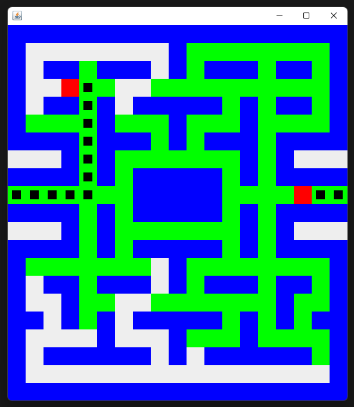

# Shortest Path PacMan Maze

A Java Swing Project that take two points inside a maze (boolean matrix) and output the shortest path, including the possibilities of teleport.

[](https://choosealicense.com/licenses/mit/)


## Usage

In order to setup the entry and leaving point you have to provide it by terminal in the following order:

```bash
    java fileName firstPointX firstPointY secondPointX secondPointY
```

You can add teleport by setting the variable:

```java
    private final ArrayList<Point> teleport = new ArrayList<>(Arrays.asList(new Point(0, 9), new Point(18, 9)));
```

Also the matrix could be change modifying the associeted matrix in the Maze.java file

## Screenshots

- The green blocks are those who were visited by the alghoritm
- The red one is the start and finish
- The black ones is the shortest path finded



